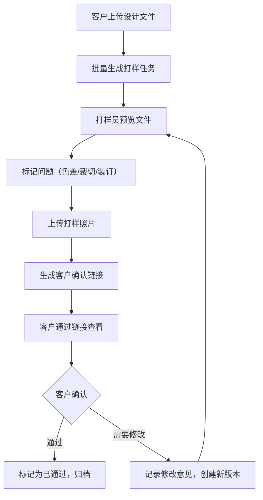

## 1. 产品概述

印刷厂打样与客户确认系统，旨在解决印刷行业中打样流程效率低下、沟通成本高、版本追踪困难等问题。系统支持客户在线上传设计文件、打样员在线审核标记、客户通过专属链接确认打样结果，实现全流程数字化管理。

- 主要用途：印刷厂打样任务管理、打样质量审核、客户在线确认、打样数据统计
- 目标用户：印刷厂客户、打样员、生产管理人员
- 核心价值：缩短打样周期、降低沟通成本、实现版本追溯、提升客户满意度

## 2. 核心功能

### 2.1 用户角色

| 角色 | 注册方式 | 核心权限 |
|------|----------|----------|
| 客户 | 无需注册，通过唯一链接访问 | 上传设计文件、查看打样状态、确认打样结果（通过/需要修改）、填写修改意见 |
| 打样员 | 系统内置角色（模拟） | 预览设计文件、标记打样问题（色差/裁切/装订）、上传打样照片、设置任务优先级、查看所有任务 |
| 管理员 | 系统内置角色（模拟） | 查看统计报表、管理所有打样任务 |

### 2.2 功能模块

1. **打样任务列表页**：任务卡片展示、优先级排序、紧急任务标红、状态筛选、搜索
2. **新建打样任务页**：多文件批量上传、客户信息填写、打印参数设置（数量/纸张/装订）
3. **打样任务详情页**：文件预览、打样问题标记、打样照片上传、历史版本记录、状态流转
4. **客户确认页**：通过唯一链接访问、查看打样结果、在线确认（通过/修改）、填写修改意见
5. **统计仪表盘**：月度打样数量统计、通过率统计、平均修改次数统计、趋势图表

### 2.3 页面详情

| 页面名称 | 模块名称 | 功能描述 |
|----------|----------|----------|
| 打样任务列表页 | 顶部导航栏 | 系统标题、新建任务按钮、统计入口、角色切换 |
| 打样任务列表页 | 筛选搜索区 | 状态筛选（待打样/打样中/待确认/已通过/需修改）、优先级筛选、关键词搜索 |
| 打样任务列表页 | 任务卡片列表 | 按优先级排序（紧急置顶）、展示客户名称、文件名、状态、优先级、创建时间 |
| 新建打样任务页 | 文件上传区 | 拖拽上传、多文件选择、支持PDF/JPG、文件列表预览与删除 |
| 新建打样任务页 | 任务表单区 | 客户名称、打印数量、纸张类型（铜版纸/哑粉纸/双胶纸/特种纸）、装订方式（骑马钉/胶装/精装/无线装订）、优先级设置 |
| 打样任务详情页 | 文件预览区 | PDF/JPG预览、缩放控制、页码导航 |
| 打样任务详情页 | 问题标记区 | 色差/裁切/装订三类问题标签、问题描述输入、标记位置记录 |
| 打样任务详情页 | 打样照片区 | 打样照片上传、照片预览、照片删除 |
| 打样任务详情页 | 版本历史区 | 每次打样记录时间、状态、修改意见、打样员、版本对比 |
| 打样任务详情页 | 操作区 | 提交打样结果、生成客户确认链接 |
| 客户确认页 | 打样信息展示 | 客户名称、文件名称、打印参数、打样问题、打样照片 |
| 客户确认页 | 确认操作区 | 通过按钮、需要修改按钮、修改意见输入框 |
| 统计仪表盘 | 数据概览卡 | 本月打样数量、本月通过率、平均修改次数、待处理任务数 |
| 统计仪表盘 | 趋势图表 | 近6个月打样数量趋势图、通过率趋势图 |
| 统计仪表盘 | 分类统计 | 按纸张类型统计、按装订方式统计、按客户统计 |

## 3. 核心流程

### 3.1 打样主流程

客户上传设计文件 → 系统生成打样任务（支持批量） → 打样员预览文件并标记问题 → 打样员上传打样照片 → 生成客户确认链接 → 客户通过链接查看并确认 → 系统更新状态并记录历史 → 如需修改则循环上述流程 → 打样完成归档

### 3.2 Mermaid 流程图

## 4. 用户界面设计

### 4.1 设计风格

- **主色调**：深邃蓝（#1e3a5f），体现印刷行业的专业与稳重
- **辅助色**：工业橙（#e85d04），用于强调和紧急任务标识
- **中性色**：浅灰背景（#f5f5f0），米白卡片（#fafaf7），营造纸张质感
- **状态色**：成功绿（#2d6a4f）、警告黄（#d4a72c）、危险红（#ba181b）
- **按钮风格**：微立体、圆角8px、悬停有微妙阴影和颜色过渡
- **字体**：标题使用 "Noto Serif SC" 宋体，体现印刷传统感；正文使用 "Noto Sans SC"，保证可读性
- **布局风格**：卡片式布局、纸张纹理背景、微妙的压印效果模拟印刷质感
- **图标风格**：线性图标，配合印刷相关元素（纸张、油墨、装订等）

### 4.2 页面设计概述

| 页面名称 | 模块名称 | UI 元素 |
|----------|----------|----------|
| 打样任务列表页 | 顶部导航栏 | 深蓝色背景、白色文字、印刷风格logo、阴影分隔线 |
| 打样任务列表页 | 筛选搜索区 | 白色卡片、下拉选择器、搜索框、圆角设计 |
| 打样任务列表页 | 任务卡片列表 | 米白卡片、纸张纹理、左侧彩色状态条、紧急任务红框标注、悬停上浮效果 |
| 新建打样任务页 | 文件上传区 | 虚线边框、拖拽高亮、文件图标、进度条动画 |
| 新建打样任务页 | 任务表单区 | 分组标签、下拉选择器、数字输入框、单选按钮组 |
| 打样任务详情页 | 文件预览区 | 带阴影的预览容器、工具栏、页码指示器、缩放动画 |
| 打样任务详情页 | 问题标记区 | 标签式分类、可折叠面板、时间线展示、标记点动画 |
| 打样任务详情页 | 版本历史区 | 垂直时间线、版本对比按钮、状态徽章 |
| 客户确认页 | 打样信息展示 | 简洁卡片布局、重点信息高亮、打样照片轮播 |
| 客户确认页 | 确认操作区 | 大尺寸主按钮、通过（绿）/修改（橙）对比、文本域 |
| 统计仪表盘 | 数据概览卡 | 渐变背景、大号数字、增长趋势小箭头、微妙发光效果 |
| 统计仪表盘 | 趋势图表 | SVG折线图、渐变色填充、数据点悬停提示 |

### 4.3 响应式设计

- **设计方式**：桌面优先（Desktop-first），最大宽度1440px，内容区1200px居中
- **平板适配（≤1024px）**：侧边栏折叠、卡片两列布局、图表缩小
- **手机适配（≤768px）**：单列布局、底部导航、卡片全屏宽度、简化表单
- **触摸优化**：按钮最小高度44px、增大点击区域、移除悬停效果改用点击反馈

### 4.4 动画与交互

- 页面加载：元素依次淡入，标题从下往上滑动
- 卡片悬停：轻微上浮（translateY(-4px)）、阴影加深
- 状态变更：状态徽章颜色渐变过渡
- 文件上传：文件项逐个滑入、进度条平滑动画
- 紧急任务：呼吸灯效果（红色边框透明度变化）
- 模态框：背景模糊、内容缩放弹出
