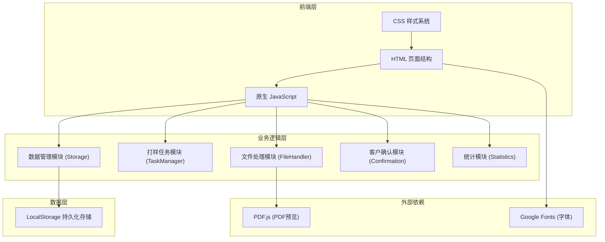
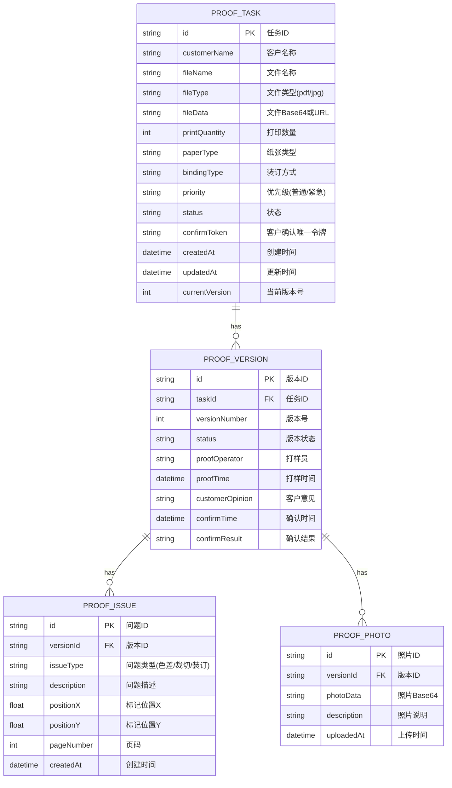

## 1. 架构设计

### 1.1 整体架构图



## 2. 技术描述

### 2.1 技术选型说明

- **前端**：原生 HTML5 + CSS3 + JavaScript (ES6+)，无需构建工具，直接运行
- **PDF预览**：PDF.js 开源库，通过CDN引入，实现浏览器端PDF预览
- **数据存储**：LocalStorage 本地存储，模拟后端数据库
- **字体**：Google Fonts - Noto Serif SC (标题)、Noto Sans SC (正文)
- **图标**：内联SVG图标，无需外部图标库
- **图表**：原生SVG绘制统计图表，无需第三方图表库

### 2.2 目录结构

```
project/
├── index.html              # 主入口 - 打样任务列表页
├── new-task.html           # 新建打样任务页
├── task-detail.html        # 打样任务详情页
├── confirm.html            # 客户确认页
├── dashboard.html          # 统计仪表盘
├── css/
│   ├── style.css           # 主样式文件
│   └── variables.css       # CSS变量与设计系统
└── js/
    ├── app.js              # 应用入口与路由
    ├── storage.js          # 本地存储管理
    ├── task-manager.js     # 打样任务业务逻辑
    ├── file-handler.js     # 文件上传与预览处理
    ├── statistics.js       # 统计计算与图表绘制
    └── mock-data.js        # 初始模拟数据
```

## 3. 页面路由（Hash路由）

| 路由 | 页面文件 | 用途 |
|------|----------|------|
| #/ | index.html | 打样任务列表页 |
| #/new | new-task.html | 新建打样任务页 |
| #/task/:id | task-detail.html | 打样任务详情页 |
| #/confirm/:token | confirm.html | 客户确认页（唯一token访问） |
| #/dashboard | dashboard.html | 统计仪表盘 |

## 4. 数据模型

### 4.1 ER图



### 4.2 状态枚举

| 状态值 | 说明 |
|--------|------|
| pending | 待打样 |
| processing | 打样中 |
| waiting_confirm | 待客户确认 |
| approved | 已通过 |
| need_revise | 需修改 |

### 4.3 LocalStorage 键定义

| 键名 | 数据类型 | 说明 |
|------|----------|------|
| proof_tasks | Array | 打样任务列表 |
| proof_versions | Array | 打样版本记录 |
| proof_issues | Array | 打样问题标记 |
| proof_photos | Array | 打样照片 |
| system_config | Object | 系统配置 |

## 5. 核心模块设计

### 5.1 Storage 模块 (storage.js)

```javascript
// 核心方法
- save(key, data)       // 保存数据到LocalStorage
- load(key)             // 从LocalStorage加载数据
- generateId()          // 生成唯一ID
- generateToken()       // 生成客户确认令牌
```

### 5.2 TaskManager 模块 (task-manager.js)

```javascript
// 核心方法
- createTask(taskData)          // 创建打样任务（支持批量）
- getTaskById(id)               // 获取单个任务
- getTaskList(filters)          // 获取任务列表（支持筛选排序）
- updateTaskStatus(id, status)  // 更新任务状态
- createVersion(taskId, data)   // 创建新版本
- addIssue(versionId, issue)    // 添加问题标记
- addPhoto(versionId, photo)    // 添加打样照片
- confirmTask(token, result, opinion)  // 客户确认打样
- setPriority(id, priority)     // 设置任务优先级
```

### 5.3 FileHandler 模块 (file-handler.js)

```javascript
// 核心方法
- handleFileSelect(files)       // 处理文件选择
- handleDrop(event)             // 处理拖拽上传
- fileToBase64(file)            // 文件转Base64
- validateFile(file)            // 文件类型/大小验证
- previewPdf(fileData)          // PDF预览初始化
- previewImage(fileData)        // 图片预览
- getFileIcon(type)             // 获取文件图标
```

### 5.4 Statistics 模块 (statistics.js)

```javascript
// 核心方法
- getMonthlyStats(year, month)  // 获取月度统计
- getTrendData(months)          // 获取趋势数据
- calculatePassRate(tasks)      // 计算通过率
- calculateAvgRevisions(tasks)  // 计算平均修改次数
- drawLineChart(container, data) // 绘制折线图
- drawPieChart(container, data)  // 绘制饼图
```

## 6. 关键技术实现

### 6.1 唯一链接生成
- 使用 `crypto.getRandomValues()` 生成32位随机令牌
- 链接格式：`#/confirm/:token`
- 每个任务对应唯一token，通过token反查任务ID

### 6.2 文件预览
- JPG/PNG：直接使用 `` 标签 + Base64
- PDF：使用 PDF.js 渲染到 `<canvas>`
- 支持缩放（0.5x - 2x）、页码导航

### 6.3 问题标记
- 在预览图上点击记录坐标
- 使用绝对定位的标记点 + 弹出层描述
- 支持三种类型标签色差：红色、裁切：黄色、装订：蓝色

### 6.4 排序规则
- 紧急任务永远置顶
- 同优先级按更新时间倒序
- 支持手动切换排序方式

### 6.5 批量打样
- 一次选择多个文件
- 每个文件独立生成任务
- 共用相同的打印参数（数量、纸张、装订）

## 7. 性能与优化

- 使用 `requestAnimationFrame` 处理动画
- 文件预览采用懒加载
- LocalStorage数据变更采用防抖写入
- 图片文件压缩后存储（最大宽度1920px，质量0.8）
- 使用CSS变量实现主题切换和响应式
